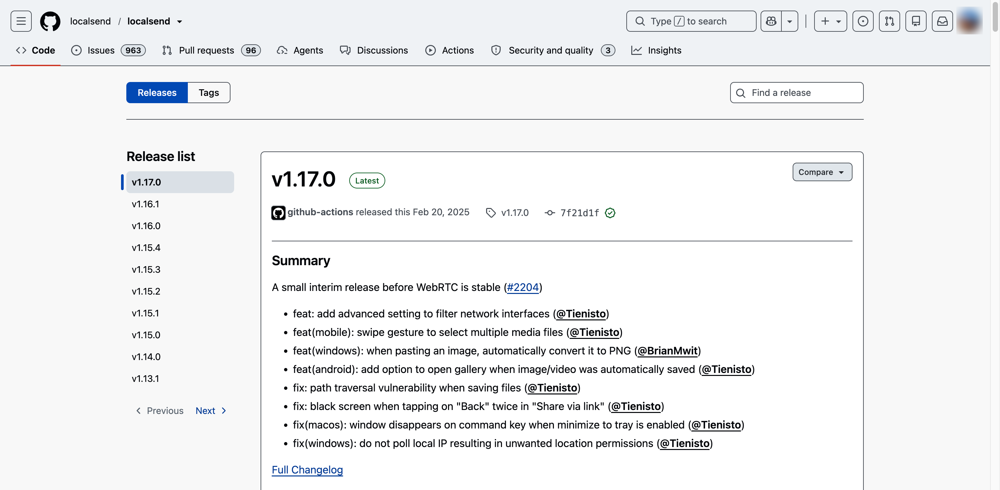
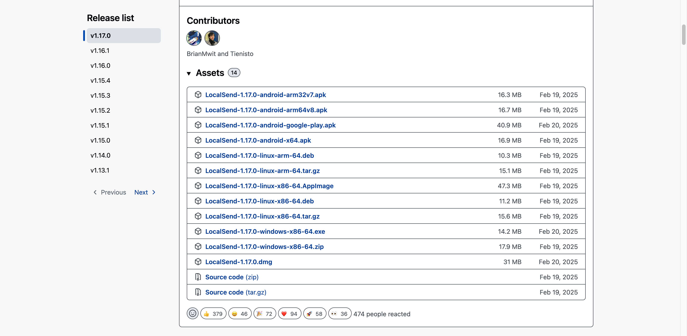
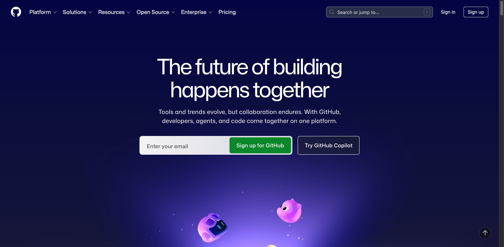
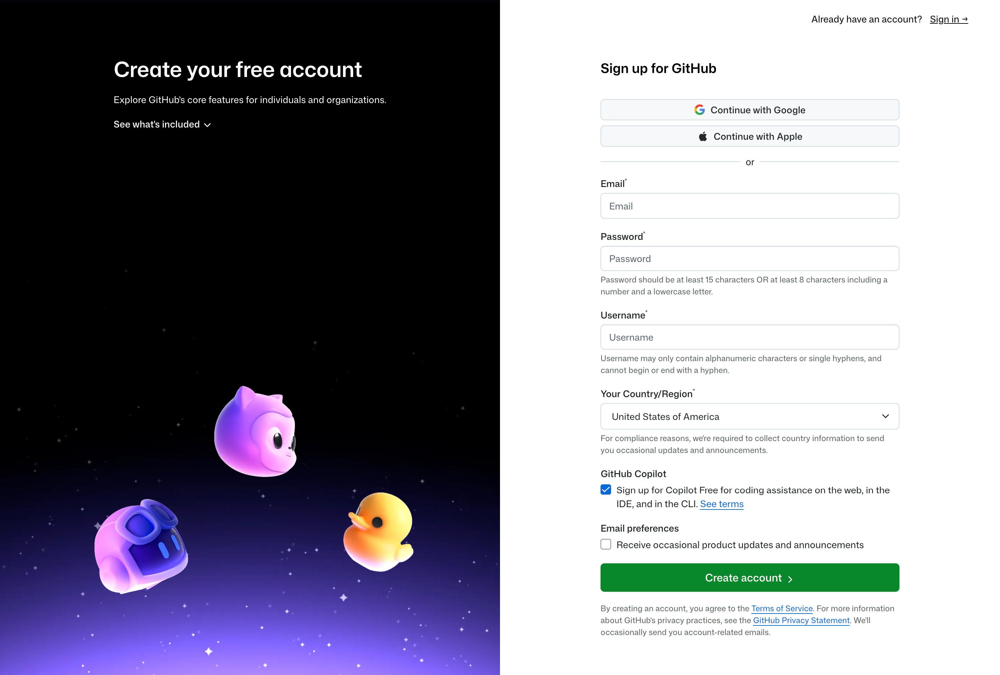

# 1.2 环境配置

以下是在正式开始前需要配置的工作环境，请按照说明操作。如有疑问，请咨询管理员。

### 一、网络浏览器

自行安装即可。我们推荐使用Chrome。


Chrome下载地址：[https://www.google.com/chrome/](https://www.google.com/chrome/)&#x20;


需要了解、阅读并保存的网址如下：

1. Current Game and Season Materials [https://ftc-resources.firstinspires.org/ftc/game](https://ftc-resources.firstinspires.org/ftc/game)
2. FIRST Tech Challenge documentation [https://ftc-docs.firstinspires.org/en/latest/index.html](https://ftc-docs.firstinspires.org/en/latest/index.html)
3. FTC AI  [https://ftc-cmchatbot.firstinspires.org/](https://ftc-cmchatbot.firstinspires.org/)
4. Techno Trojans  [https://www.fruitportrobotics.org/](https://www.fruitportrobotics.org/)
5. FTC Event Web\_Team 32477 [https://ftc-events.firstinspires.org/team/32477](https://ftc-events.firstinspires.org/team/32477)
6. 32477\_ FTCScout  [https://ftcscout.org/teams/32477](https://ftcscout.org/teams/32477)
7. Github FTC 32477 [https://github.com/ftc32477](https://github.com/ftc32477)

### 二、网络环境

1. 局域网：\
   工作区配备有线和无线局域网。\
   无线局域网名称为BNDES-FTC，网关为192.168.3.1，无线网络标准为802.11ax。\
   密码请咨询管理员。
2. 互联网：\
   具体操作请咨询管理员。

### 三、LocalSend

LocalSend是我队采用的局域网文件传输工具。

**安装流程（以v1.17.0版本为例）：**


对于**iOS**系统：打开 [https://apps.apple.com/us/app/localsend/id1661733229](https://apps.apple.com/us/app/localsend/id1661733229) 安装即可。




#### 进入GitHub仓库

打开 [https://github.com/localsend/localsend/releases](https://github.com/localsend/localsend/releases) 。

<figure><figcaption></figcaption></figure>



#### 选择版本并安装

下滑页面，在最新版本的窗口下的Assets列表中点击“Show all \* assets”来显示所有可用版本。

下载对应版本并安装即可。


对于**Android系统：**\
“-android-arm32v7.apk”是针对32位ARM第7代CPU架构所构建的版本；\
“-android-arm64v8.apk”是针对64位ARM第8代CPU架构所构建的版本；\
“-android-google-play.apk”是针对Google Play 商店所构建的版本（可能需要 Google Mobile Services 支持）；\
“-android-x64.apk”是针对64位x86架构所构建的版本。

对于**Linux系统**：\
“-linux-arm-64.deb”是针对64位ARM架构Debian/Ubuntu等系统所构建的Deb安装包版本；\
“-linux-arm-64.tar.gz”是针对64位ARM架构Linux系统所构建的通用压缩包版本；\
“-linux-x86-64.AppImage”是针对64位x86架构Linux系统所构建的AppImage可执行版本；\
“-linux-x86-64.deb”是针对64位x86架构Debian/Ubuntu等系统所构建的Deb安装包版本；\
“-linux-x86-64.tar.gz”是针对64位x86架构Linux系统所构建的通用压缩包版本。

对于**Windows系统**：\
“-windows-x86-64.exe”是针对64位x86架构所构建的安装程序版本；\
“-windows-x86-64.zip”是针对64位x86架构所构建的免安装压缩包版本。

对于**macOS系统**：\
“.dmg”是针对macOS系统所构建的磁盘镜像安装包版本。


<figure><figcaption></figcaption></figure>



### 四、GitHub

GitHub是我队采用的开源资料存储仓库。

**注册流程：**



### 进入官网

打开 [https://github.com/](https://github.com/) 并单击页面右上角的“Sign up”。

<figure><figcaption></figcaption></figure>



### 注册账户

按照提示创建个人帐户。


注册期间，系统会要求验证电子邮件地址。

我们建议将“Your Country/Region”选择为“United States of America”。


<figure><figcaption></figcaption></figure>



### 加入组织

注册完成后，请向管理员告知你的用户名，并等待管理员向你发来加入组织邀请，你可以在 [https://github.com/notifications](https://github.com/notifications) 查收。



而后，你就可以在 [https://github.com/orgs/ftc32477/repositories](https://github.com/orgs/ftc32477/repositories) 查看、修改仓库了。
